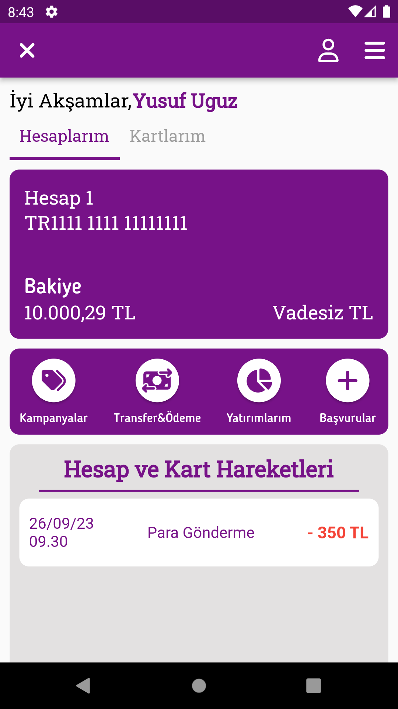
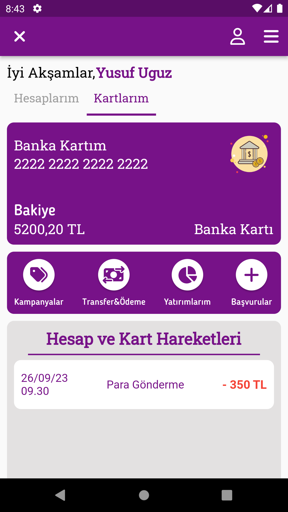
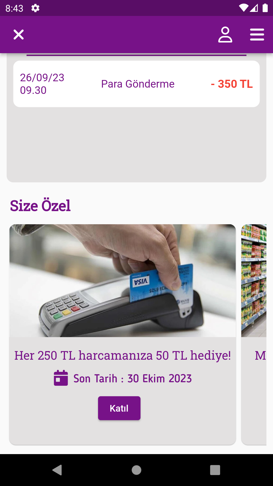
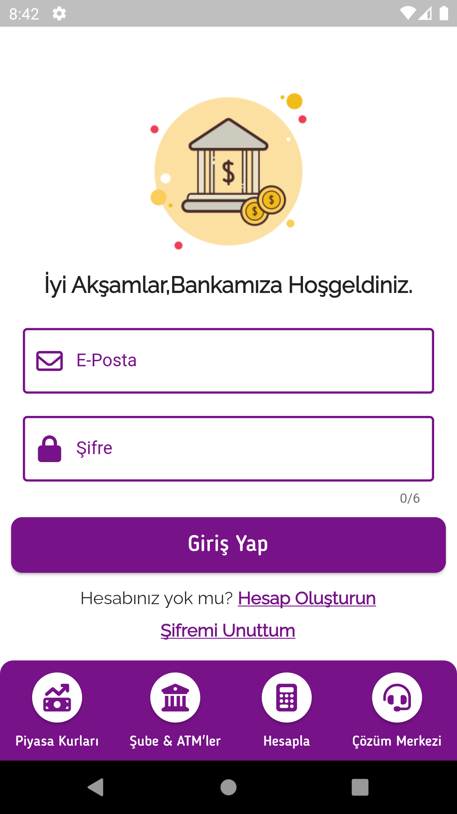
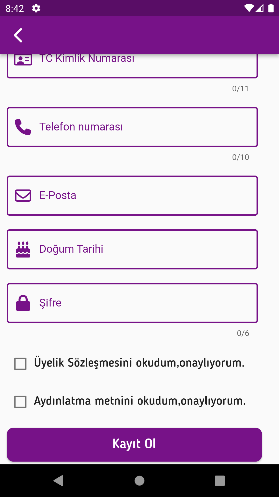
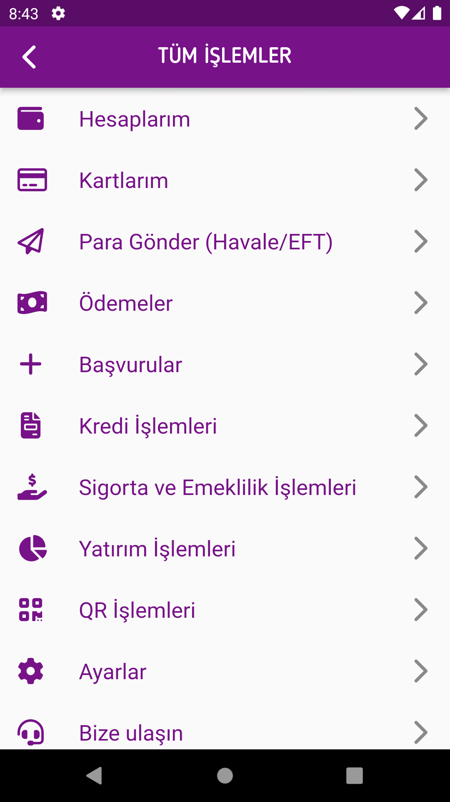

A Bank App with Flutter 

Features: 
:heavy_check_mark: On the homepage, the user can view their cards and bank accounts, be directed to some pages such as campaigns and investments, view account and card transactions, and view some special campaigns. This information is brought from the firebase database specifically for the user. 
:heavy_check_mark: The user can use the login and register features, these features are provided with firebase authentication. 

Technologies: 
:pushpin: Flutter 
:pushpin: Dart 
:pushpin: Firebase Authentication 
:pushpin: Firebase Database 

Home Screen 
 
 
 
Login Screen  
 
Register Screen  

Menu Screen  
 

This project created by [YusufUguz](https://github.com/YusufUguz) 
